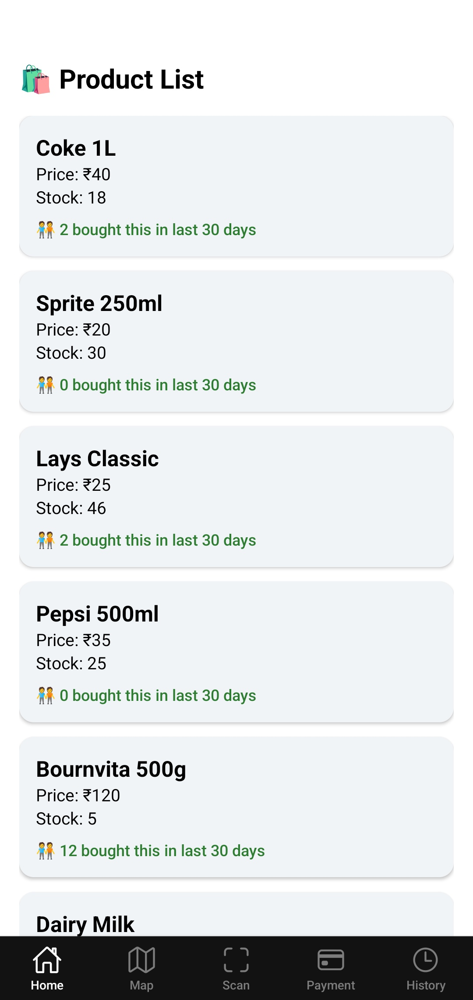
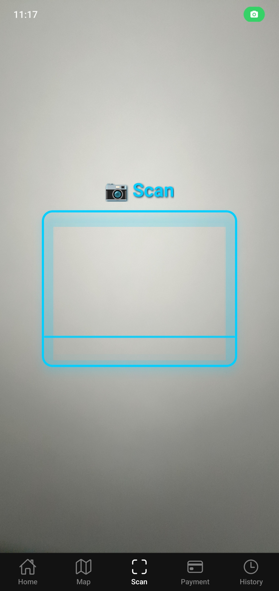
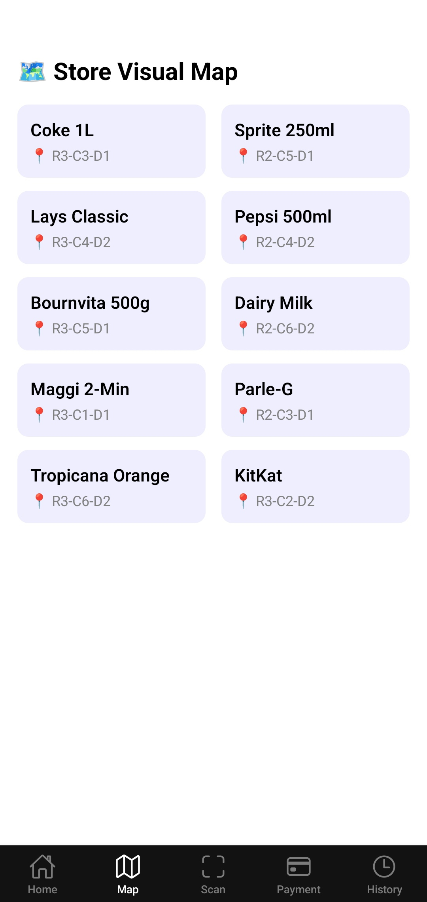
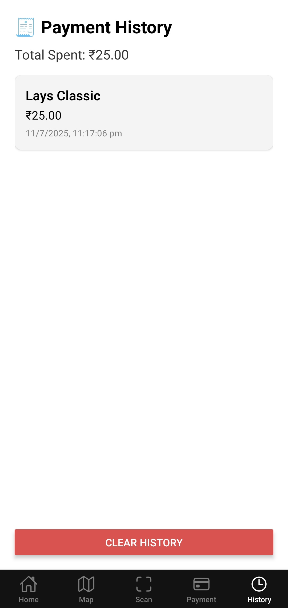
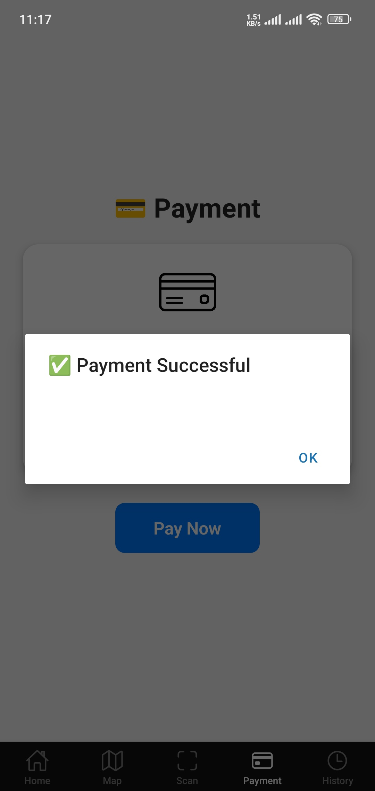
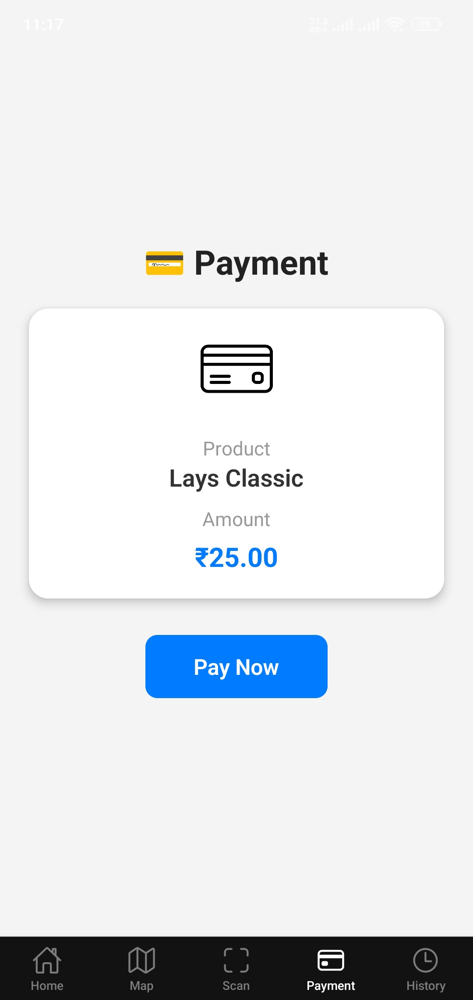

# 🛒 ShopGenie App (Frontend)

**ShopGenie** is a smart in-store shopping assistant mobile app designed to help differently-abled customers easily navigate stores, scan items via QR codes, and make instant payments. Built using **React Native (Expo)**, the app offers a clean UI and supports features like item popularity, visual store maps, scan-to-pay, and payment history.

## 🚀 Features

- 📦 Product listing with brand, stock, and popularity insights
- 🗺️ Interactive visual store map (floor > row > column > drawer)
- 📲 QR scan to pay with real-time product lookup
- 💳 Simulated payment interface
- 🧾 Local payment history tracking
- 🌐 Fully integrated with deployed backend on Render

## 📸 Screenshots

### 📱 Home Screen


### 🔍 QR Scan 


### 🗺️ Store Map


### 🗺️ Payment History


### 🗺️ Payment Success


### 🗺️ Pay


## 🧑‍💻 Tech Stack

- **React Native (Expo)**
- **TypeScript**
- **Expo Camera + Barcode Scanner**
- **AsyncStorage for local payment history**
- **REST API Integration with Express + MongoDB**

## 📦 Installation

```bash
git clone https://github.com/hridayansh/shopgenie-app.git
cd shopgenie-app
npm install
npx expo start
```

## Backend API

Backend deployed at:
🔗 https://shopgenie-backend-lm88.onrender.com

## 🔗 Live Project

i will upload live link soon

## 📄 License

This project is for educational and demo purposes only.
